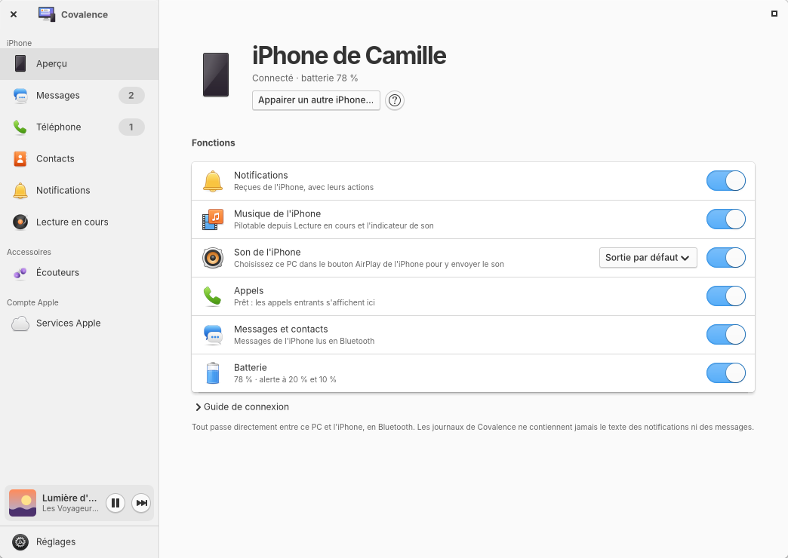
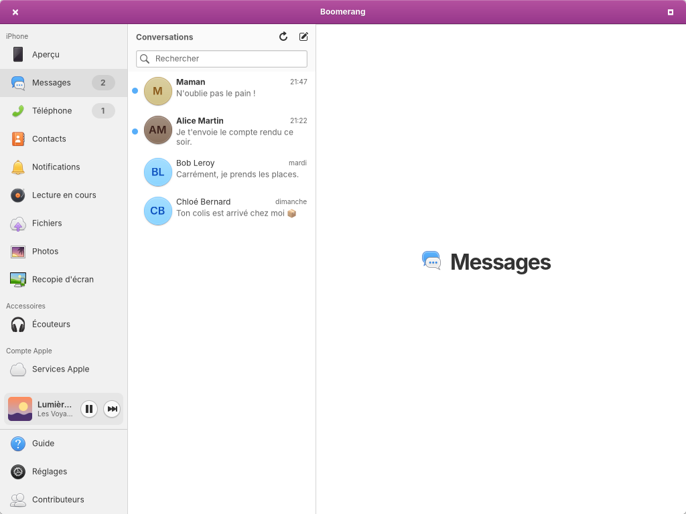

<div align="center">


# Boomerang

**Votre iPhone et votre compte Apple, chez eux sur elementary OS.**

[](LICENSE)


[Site](https://melvincouwez-alt.github.io/boomerang/fr/) ·
[Télécharger](https://github.com/melvincouwez-alt/boomerang/releases/latest) ·
[English](README.en.md)



</div>

Boomerang intègre l'iPhone et iCloud à elementary OS : notifications, messages, appels,
contacts, AirPods, courriel, agendas, rappels, iCloud Drive et Photos. Boomerang fonctionne
entièrement sur votre ordinateur. L'iPhone communique avec l'ordinateur par Bluetooth, iCloud
par Internet, et aucune donnée ne transite par un serveur autre que ceux d'Apple.

*Boomerang s'appelait Covalence jusqu'à la version 0.6. La mise à jour vers Boomerang conserve
vos réglages, vos messages et vos comptes iCloud.*

> **Alpha.** La version 0.8 est un aperçu public. Son auteur l'utilise tous les
> jours sur son ordinateur, mais des anomalies restent possibles. L'interface est en français ;
> la traduction anglaise est en bêta.

## Deux connexions

### Connexion iPhone (Bluetooth)

| | |
|---|---|
| **Notifications** | Toutes les notifications de l'iPhone sur le bureau, avec leurs actions et l'icône de l'app qui les envoie. Vous choisissez les apps dont les notifications s'affichent. |
| **Lecture en cours** | Ce que joue l'iPhone, avec pochette, progression et volume, dans sa page et dans un mini-lecteur au-dessus de Réglages. Le bouton Lecture relance la musique de l'iPhone, même lorsqu'elle est arrêtée. |
| **Batterie** | Niveau de batterie de l'iPhone dans le panneau, alertes à 20 % et à 10 %. |
| **Messages** | Lire vos conversations SMS, répondre à un seul destinataire, enregistrer des brouillons, rechercher. Supprimer un message ou une conversation dans Boomerang (l'élément reste sur l'iPhone). |
| **Téléphone** | Répondre, refuser et passer des appels avec le micro et les haut-parleurs de l'ordinateur, clavier, journal d'appels. Nécessite PipeWire 1.4 ou une version plus récente. |
| **Contacts** | Les contacts de l'iPhone en Bluetooth (lecture seule), ou vos contacts iCloud, modifiables. |
| **AirPods** | Batterie de chaque écouteur et du boîtier, contrôle du bruit, détection de conversation, détection des oreilles, renommage, d'après le protocole documenté par LibrePods. Expérimental : hocher la tête pour répondre à un appel, la secouer pour le refuser. |
| **Son de l'iPhone** | Recevoir sur l'ordinateur le son que l'iPhone envoie depuis le bouton AirPlay, ou refuser cette diffusion. |

<p align="center">


</p>

### Connexion Services Apple (Internet)

| | |
|---|---|
| **Courriel, agendas, rappels et contacts iCloud** | Evolution Data Server les ajoute aux apps Courriel, Tâches et agenda d'elementary. La connexion utilise un mot de passe pour app. |
| **iCloud Drive** | Un dossier dans Fichiers, grâce à [rclone](https://rclone.org). |
| **iCloud Photos** | Vos albums dans Fichiers, en lecture seule, grâce à rclone. |

<p align="center">


</p>

> **À propos d'iCloud Drive et Photos.** rclone se connecte comme le site icloud.com, avec le
> mot de passe de votre compte Apple et la double authentification. Apple ne propose pas cet
> accès officiellement : ses conditions d'utilisation d'iCloud limitent l'accès automatisé et
> l'autorisent à suspendre un compte. Cette fonction demande aussi de désactiver la Protection
> avancée des données, ce qui réduit le chiffrement de bout en bout de vos données iCloud. Le jeton de
> connexion expire environ une fois par mois. Vous utilisez cette fonction à vos risques ;
> Boomerang vous demande d'accepter ces risques avant la connexion.

## Installation

### Depuis le paquet (conseillé)

1. Téléchargez `boomerang_0.8.2-1_amd64.deb` depuis la
   [dernière version](https://github.com/melvincouwez-alt/boomerang/releases/latest).
2. Installez-le dans un terminal, depuis le dossier du téléchargement :
   `sudo apt install ./boomerang_0.8.2-1_amd64.deb`. apt installe également les dépendances
   nécessaires. Sur Ubuntu, un double-clic sur le fichier l'ouvre aussi dans l'App Center.
3. Fermez puis rouvrez votre session (ou lancez `systemctl --user start boomerangd`), puis
   ouvrez Boomerang. L'assistant vous guide pour appairer l'iPhone et vous connecter à iCloud.

Si un composant manque par la suite, Boomerang le signale dans « Composants manquants » avec un
bouton « Installer » (PackageKit demande votre mot de passe). Pour iCloud Drive et Photos, le
bouton « Télécharger rclone » récupère la version officielle de rclone et vérifie son empreinte
SHA-256 (la commande `boomerangd --fetch-rclone` fait la même opération dans un terminal).

Désinstallation : `sudo apt remove boomerang`. Vos données restent dans
`~/.local/share/boomerang` et `~/.config/boomerang` tant que vous ne les supprimez pas (voir
[confidentialité](docs/confidentialite.md)).

### Compatibilité

| Système | État |
|---|---|
| elementary OS 8 ou plus récent | Tout fonctionne. Les appels demandent PipeWire 1.4 ou plus récent : avec un PipeWire plus ancien, Boomerang désactive les appels et en indique la raison. |
| Ubuntu 24.04 ou plus récent | Le paquet demande Granite 7.7 ou plus récent. Les appels demandent PipeWire 1.4 ou plus récent. Ubuntu 24.04 fournit rclone 1.60, trop ancien pour iCloud : utilisez le bouton « Télécharger rclone ». |

Matériel : un adaptateur Bluetooth compatible Bluetooth Low Energy (c'est le cas de presque
tous les modèles récents).

### Depuis les sources

```sh
meson setup build --prefix=$HOME/.local
ninja -C build && meson install -C build
systemctl --user daemon-reload && systemctl --user enable --now boomerangd
```

Dépendances de construction : `valac`, `meson`, `libgranite-7-dev` (7.7 ou plus récent),
`libgtk-4-dev`. Les dépendances d'exécution sont listées dans `debian/control`. Tests hors
ligne : `python3 -m unittest tests.test_offline`. Paquet : `packaging/build-deb.sh`.

## Ce que Boomerang ne sait pas faire

Ces limites viennent surtout de ce qu'un iPhone accepte d'un ordinateur non Apple :

- Pas d'envoi d'iMessage, pas de réponse dans les groupes, pas de pièces jointes : par Bluetooth,
  l'iPhone permet seulement d'envoyer un SMS à une seule personne.
- Pas de presse-papiers universel, de Handoff, d'AirDrop ni de Caméra de continuité : ces
  fonctions exigent le chiffrement et la pile Wi-Fi propres à Apple.
- Supprimer un message ne le retire que de Boomerang. iOS ignore les suppressions
  demandées par Bluetooth.
- L'iPhone ne se reconnecte pas toujours automatiquement à un accessoire Bluetooth LE. Le
  [guide](data/guide/fr/12-troubleshooting.md) décrit la procédure à suivre.
- Le déverrouillage de l'ordinateur avec l'iPhone est volontairement exclu : la force du signal
  Bluetooth peut être falsifiée.

## Nouveautés de la 0.8

Depuis la 0.7.0 :

- Messages : chaque conversation s'ouvre sur le dernier message. Vous pouvez la personnaliser
  (surnom, emoji, couleur des bulles, fond, taille du texte) et régler ses notifications
  (prioritaires, silencieuses, son personnalisé). Recherche dans la conversation (Ctrl+F), bouton
  pour revenir aux nouveaux messages, ligne « Non lus », réponses rapides personnalisées,
  aperçus de liens (désactivés par défaut), export en PDF ou en texte.
- Notifications : réglage par application de l'iPhone (normales, prioritaires ou discrètes),
  son personnalisé et, si vous le souhaitez, contenu masqué dans la bannière.
- Recopie de l'écran dans une fenêtre Boomerang à la taille de l'image, avec plein écran (F11),
  enregistrement MP4 facultatif et, en expérimental, une balise Bluetooth pour que l'iPhone
  trouve l'ordinateur.
- AirPods, en expérimental : hocher la tête pour répondre à un appel, la secouer pour le
  refuser.
- Page Contributeurs, sous Réglages : tous les projets dont Boomerang dépend, avec leurs
  auteurs, leurs licences et leurs liens.
- Fenêtre principale avec une seule barre d'en-tête aux couleurs de Boomerang, colonne de
  gauche repliable en icônes (F9).
- Service et application moins actifs en arrière-plan, nouvelle icône dans le style
  d'elementary.

## Aide

Boomerang contient un guide intégré, en français et en anglais (F1, ou Guide dans la barre latérale). Il
explique l'appairage, les réglages à activer sur l'iPhone, iCloud, les AirPods et le
dépannage. Questions et signalements :
[Issues](https://github.com/melvincouwez-alt/boomerang/issues).

## Auteur

Je ne suis pas développeur. Je suis un passionné d'elementary OS, utilisateur d'iPhone, avec
quelques idées, et je construis Boomerang en « vibe coding » avec Claude, l'assistant
d'Anthropic : je décris ce que je veux, je teste chaque jour sur mon propre ordinateur, et
nous corrigeons ensemble. Le code est ouvert pour que les personnes qui s'y connaissent mieux
puissent le lire, signaler les erreurs et aider. Contributions, signalements et conseils
bienveillants sont les bienvenus.

melvincouwez-alt

## Fonctionnement

- **boomerangd**, le service (Python, PyGObject) : il maintient la liaison Bluetooth et
  conserve les secrets. Il communique avec l'iPhone par BlueZ (ANCS et AMS en Bluetooth LE, MAP et PBAP par obexd,
  HFP par `org.pipewire.Telephony` de PipeWire), à iCloud par Evolution Data Server et
  libsecret, et lance rclone pour Drive et Photos.
- **L'application** (Vala, GTK 4, Granite) : une fenêtre, plus des apps séparées Messages,
  Téléphone, Contacts et Écouteurs pour le dock. Elle communique avec le service par D-Bus
  (`io.github.melvincouwez.Boomerang.Daemon`).
- Les journaux ne contiennent jamais le texte des notifications ou des messages, ni les noms ni
  les numéros.

## Merci

Boomerang repose sur le travail de nombreux logiciels libres. La page **Contributeurs** de l'app, sous Réglages, les présente tous avec leurs auteurs, leurs licences et leurs liens :

| Projet | Sert à | Licence |
|---|---|---|
| [rclone](https://github.com/rclone/rclone) (Nick Craig-Wood et contributeurs) | iCloud Drive et Photos | MIT |
| [LibrePods](https://github.com/librepods-org/librepods) (Kavish Devar et contributeurs) | Protocole des AirPods et gestes de tête, portés en Python dans `boomerangd/headphones.py` | GPL-3.0-or-later |
| [BlueZ](https://github.com/bluez/bluez) et obexd | Bluetooth, messages et contacts | GPL-2.0-or-later (bibliothèques LGPL-2.1-or-later) |
| [PipeWire](https://gitlab.freedesktop.org/pipewire/pipewire) et [WirePlumber](https://gitlab.freedesktop.org/pipewire/wireplumber) | Appels et son de l'iPhone | MIT |
| [Evolution Data Server](https://gitlab.gnome.org/GNOME/evolution-data-server) | Comptes iCloud | LGPL |
| [libsecret](https://gitlab.gnome.org/GNOME/libsecret) | Mots de passe dans le trousseau | LGPL-2.1-or-later |
| [GTK](https://gitlab.gnome.org/GNOME/gtk), [Granite](https://github.com/elementary/granite), [Vala](https://gitlab.gnome.org/GNOME/vala), [PyGObject](https://gitlab.gnome.org/GNOME/pygobject) | L'application et le service | LGPL (Granite : LGPL-3.0-or-later) |
| [LocalSend](https://github.com/localsend/protocol) | Fichiers avec l'iPhone, protocole v2 | protocole public |
| [UxPlay](https://github.com/FDH2/UxPlay) | Recopie de l'écran, son enregistrement et sa balise Bluetooth (lancé par Boomerang, facultatif) | GPL-3.0 |
| [libimobiledevice](https://github.com/libimobiledevice/libimobiledevice) et [ifuse](https://github.com/libimobiledevice/ifuse) | Import des photos par câble USB (facultatif) | LGPL-2.1-or-later |
| [libheif](https://github.com/strukturag/libheif) | Photos HEIC converties en JPEG (facultatif) | LGPL-3.0 |
| [Icônes elementary](https://github.com/elementary/icons) | Objets à partir desquels les icônes de Boomerang sont dessinées | GPL-3.0 |
| [Inter](https://github.com/rsms/inter) (Rasmus Andersson) | Texte de l'icône Calendrier, en contours | SIL OFL 1.1 |
| Android Open Source Project et [Kenney](https://kenney.nl/assets/interface-sounds) | Sons des notifications (détail dans [docs/credits-sons.md](docs/credits-sons.md)) | Apache-2.0 / CC0 |

Boomerang installe deux applications compagnes depuis l'onglet Services Apple, chacune publiée
dans son propre dépôt avec ses versions : **Agenda**
([code source et téléchargements](https://github.com/melvincouwez-alt/agenda), GPL-3.0-or-later) et **Cassette**,
un client Apple Music issu de [Sidra](https://github.com/wimpysworld/sidra), de Martin Wimpress,
et construit sur [CastLabs Electron](https://github.com/castlabs/electron-releases)
([code source et téléchargements](https://github.com/melvincouwez-alt/cassette), Blue Oak Model License 1.0.0).

Un merci particulier à l'équipe de LibrePods pour son remarquable travail de rétro-ingénierie,
et à [nRF Connect](https://www.nordicsemi.com/Products/Development-tools/nRF-Connect-for-mobile)
(Nordic Semiconductor), une app iPhone gratuite qui a servi aux premiers appairages et peut encore servir au besoin.

## Mentions légales

Boomerang est un logiciel libre sous [licence GNU GPL version 3 ou ultérieure](LICENSE). Il est
fourni sans aucune garantie.

Boomerang est un projet indépendant. Il n'est ni affilié à Apple Inc. ou à elementary, Inc., ni
approuvé, sponsorisé ou soutenu par eux. Apple, iPhone, iCloud, iMessage, AirPods, AirPlay et
Apple Music sont des marques d'Apple Inc., déposées aux États-Unis et dans d'autres pays et
régions. Ces noms sont cités uniquement pour indiquer les produits et services avec lesquels Boomerang
fonctionne.

Boomerang utilise des protocoles publiés (Bluetooth HFP, MAP, PBAP ; ANCS et AMS, spécifiés par
Apple ; CalDAV, CardDAV, IMAP). Deux fonctions reposent sur des interfaces non documentées : les
AirPods (protocole AAP décrit par LibrePods) et iCloud Drive et Photos (via rclone). Elles
peuvent cesser de fonctionner sans préavis. Boomerang n'a décompilé aucun logiciel Apple.

- Confidentialité : [français](docs/confidentialite.md) · [English](docs/privacy.md). Pas de
  télémétrie, pas de compte, pas de serveur.
- Mentions légales : [docs/mentions-legales.md](docs/mentions-legales.md).
